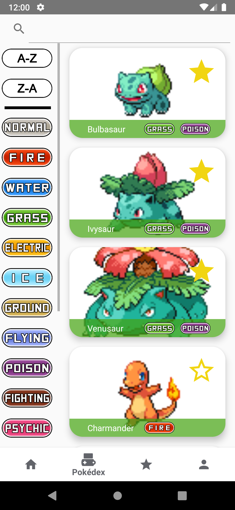
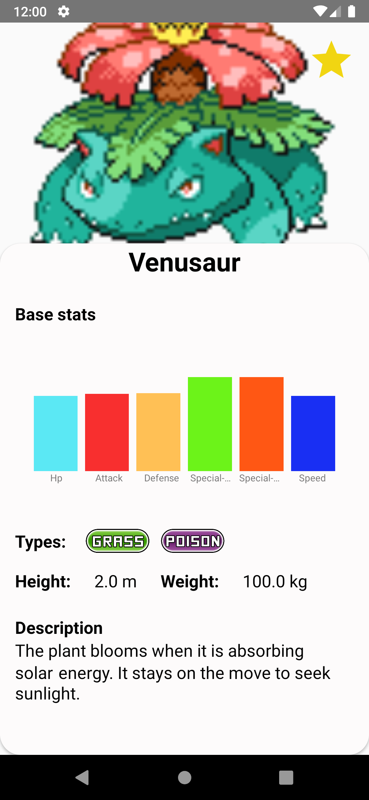

# PFCPokeSearch

PokeSearch es una aplicación Android de código abierto que permite buscar, filtrar y obtener información detallada
sobre cualquier Pokemon existente.
Hecha en Android estudio utilizando [PokeApi](https://pokeapi.co/) y [Firebase](https://firebase.google.com/?hl=es).

## Características
 - Sistema de login y registro básicos utilizando Firebase.
 - Sistema de login con Google utilizando Firebase.
 - Pantalla de Home que genera información sobre un Pokemon aleatorio.
 - Pantalla Pokédex donde se pueden filtrar Pokemon mediante filtros y sus combinaciones además de la posibilidad de añadirlos a favoritos
 - Pantalla de Favoritos donde puedes ver tus Pokemon favoritos y filtrarlos como en Pokédex
 - Pantalla Detalle a la cual se accede al hacer click en un Pokemon la cual muestra información del Pokemon seleccionado
 - Pantalla Imagen Completa a la cual se accede al hacer click en la imagen en la ventana de Detalle la cual muestra la imagen en pantalla completa
 - Pantalla de Options donde se muestra el email con el que el usuario ha hecho login y el tipo de proveedor además de poder hacer logout

## Capturas de pantalla

## Herramientas y librerías utilizadas
- [PokeApi](https://pokeapi.co/).
- [Firebase](https://firebase.google.com/?hl=es).
- [Retrofit2](https://square.github.io/retrofit/).
- [Dagger Hilt](https://dagger.dev/hilt/).
- Room
- [Picasso](https://square.github.io/picasso/).

